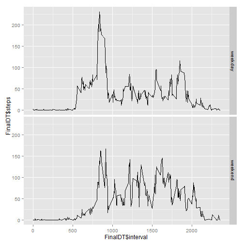

First of all is setting the working directory.
Then read the data frame.

```r
raw <- read.csv("activity.csv")
```
Then using the lubridate library altering  the date variable to be seen as a date
class.

```r
library(lubridate) 
raw$date <- ymd(raw$date)
```
Using the reshape2 library to melt and dcast the data set using the correspondent functions to calculate the sum of steps taken per day.

```r
library(reshape2)
melted <- melt(raw, id.vars = "date", measure.vars = "steps")
decasted <- dcast(melted, date ~ variable, sum, na.rm = TRUE)
```
Then create a histogram for the steps taken per day using the base system plotting system.

```r
hist(decasted$steps, breaks = 10)
```

 

The median and the mean are as shown below. 

```r
median(decasted$steps)
```

```
## [1] 10395
```

```r
mean(decasted$steps)
```

```
## [1] 9354.23
```
Once again using the reshape2 library to alter the data we have and calculate the average number of steps taken per interval across all days.


```r
melted2 <- melt(raw, id.vars = "interval", measure.vars = "steps")
decasted2 <- dcast(melted2, interval ~ variable, mean , na.rm = TRUE)
```
Next, create the time series using the base plot system.


```r
plot(x = decasted2$interval, y = decasted2$steps, type = "l",
     ylab = "Average Steps per Interval", xlab = "Interval ID")
```

 

The 5-minute interval, on average across all the days in the dataset, that contains the maximum number of steps is:


```r
unique(raw$interval)[max(decasted2$steps)]
```

```
## [1] 1705
```
Total number of missing values in the data set is:


```r
sum(is.na(raw$steps))
```

```
## [1] 2304
```

Substituting the NAs with their interval mean across all days.   
First, we save the indices of the NAs, then consider the intervals they happened in to use the averages of those intervals.  
Using the sapply function to loop through the NAs interval vector then using the decasted2 to get the corresponding interval mean across days.   


```r
nas <- which(is.na(raw$steps))
naInterval <- raw[nas,3]
values <- sapply(naInterval, function(x) decasted2[decasted2$interval == x, 2])
```
After getting the NAs interval average we creat a new data frame by copying the original data frame. then substituting  the NAs with the obtained values.

```r
rawfilled <- raw
rawfilled[which(is.na(rawfilled$steps)),1] <- values
```
Altering the filled data with rreshape2 library to calculate the total number of steps taken each day

```r
meltedfilled <- melt(rawfilled, id.vars = "date", measure.vars = "steps")
decastedfilled <- dcast(meltedfilled, date ~ variable, sum)
```
Then create histogram of the total number of steps taken each day 

```r
hist(decastedfilled$steps, breaks = 10, main = "Histogram of Average Steps per Day", xlab = "Average Steps per Day")
```

 

The mean and median total number of steps taken per day in the filled data is:

```r
median(decastedfilled$steps)
```

```
## [1] 10766.19
```

```r
mean(decastedfilled$steps)
```

```
## [1] 10766.19
```
As we used the mean to replace NAs data become more concentrated around its mean and less data appears in the first bin.    
   
    
       
   
To contrast weekdays and weekends we add a day name column to the filled data set then we creat a data frame of tow variable, one stating the day name and the other specifying whether it is a weekday or a weekend. Lastly using sapply function to add fill a new column in the filled data set categorizing all days into weekdays and weekends.  

```r
rawfilled$day <- weekdays(rawfilled$date)
dayname <- c("Monday","Tuesday","Wednesday","Thursday","Friday","Saturday","Sunday")
status <- c (rep("weekday", 5),rep("weekend", 2))
daygroup <- data.frame(dayname, status)
rawfilled$status <- sapply(rawfilled$day, function(x) daygroup[daygroup$dayname == x, 2])
```
Using reshape2 library to calculate different interval means during weekdays and weekends,

```r
dataMelt <- melt(rawfilled, id.vars = c("status", "interval") ,measure.vars = "steps")
FinalDT <- dcast(dataMelt, status + interval ~ variable , mean)
```
At the end, using ggplot2 library to plot the data of the two day groups.

```r
library(ggplot2)
qplot(x = FinalDT$interval, y = FinalDT$steps, data = FinalDT ,facets = status~. ,geom = "line")
```

 
